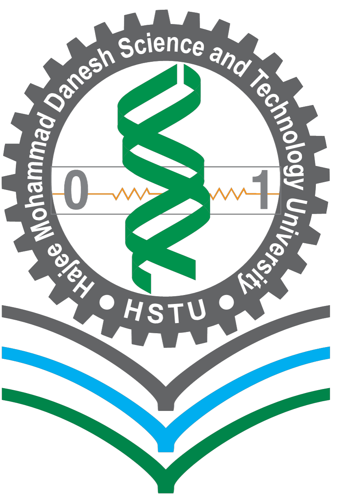

<p align="center">
  
</p>
<h1 align="center">
  <b> DNA Cryptography Algorithm (DNACrypto)</b>
</h1>
<h3 align="center">
  <br>
  <b>Level-3 Semester-II Assignment</b>  
</h3>
<h3 align="center">
  Course Code: CSE 361 
</h3>

<h3 align="center">
  Course Title: Mathematical Analysis for Computer Science
</h3>
<br>
<h3 align="center">
  Submitted by 
</h3>
<h3 align="center">
<b>Moniruzzaman Porag (ID: 2102044) </b> </h3>
<br>

<h3 align="center">
  Submitted To 
</h3>

<h3 align="center"><b>Pankaj Bhowmik  </b></h3>
<h3 align="center"><b>Lecturer, Department of CSE</b></h3>
<br>
<h3 align="center"> <b>Department of Computer Science and Engineering </b></h3>
<h3 align="center"><b>Hajee Mohammad Danesh Science and Technology University  
Dinajpur-5200</b></h3>

  ---

## Table of Contents

1. [Introduction](#1-introduction)
2. [Key Concepts](#2-key-concepts)
   - [DNA Base Mapping](#dna-base-mapping)
   - [Mutation Rules](#mutation-rules)
3. [Encryption Algorithm (DNACrypto-Enc)](#3-encryption-algorithm-dnacrypto-enc)
   - [Input](#input)
   - [Output](#output)
   - [Steps](#steps)
   - [Encryption Formula](#encryption-formula)
4. [Decryption Algorithm (DNACrypto-Dec)](#4-decryption-algorithm-dnacrypto-dec)
   - [Input](#input-1)
   - [Output](#output-1)
   - [Steps](#steps-1)
   - [Decryption Formula](#decryption-formula)
5. [Dry Run Example](#5-dry-run-example)
   - [Encryption Dry Run](#step-1-ascii-to-binary)
   - [Decryption Dry Run](#6-decryption-dry-run-for-atta)
6. [Advantages](#7-advantages)
7. [Limitations](#8-limitations)
8. [Applications](#9-applications)
9. [Flowchart Overview](#10-flowchart-overview)

---

# DNA Cryptography Algorithm (DNACrypto)

## 1. Introduction
DNA Cryptography is an innovative security method inspired by biological DNA, which stores complex information using four chemical bases: Adenine (A), Thymine (T), Cytosine (C), and Guanine (G). This algorithm uses DNA-like sequences to securely encode plaintext messages with an additional layer of mutation for enhanced security.

---

## 2. Key Concepts

### DNA Base Mapping:
| Binary | DNA Base |
|--------|----------|
| 00     | A        |
| 01     | T        |
| 10     | C        |
| 11     | G        |

### Mutation Rules:
- **Complement:** A ⇆ T, C ⇆ G
- **Reverse:** Reverse the sequence (applied only for odd keys)

---

## 3. Encryption Algorithm (DNACrypto-Enc)

### Input:
- Plaintext 'P'
- Key 'K'

### Output:
- Ciphertext 'C'

### Steps:
1. Convert each character in `P` to its 8-bit binary value.
2. Divide the binary into 2-bit chunks and map to DNA bases.
3. Apply mutations:
   - If 'K' is **even**: Apply complement only.
   - If 'K' is **odd**: Apply complement and reverse.
4. Concatenate the mutated sequences to produce `C`.

### Encryption Formula:
```
b_i = B(p_i)
d_i = D(b_i)
m_i = Comp(d_i)                if K % 2 == 0
m_i = Rev(Comp(d_i))           if K % 2 == 1
C = {m_1, m_2, ..., m_n}
```

---

## 4. Decryption Algorithm (DNACrypto-Dec)

### Input:
- Ciphertext `C`
- Key `K`

### Output:
- Plaintext `P`

### Steps:
1. Split the ciphertext into individual DNA sequences.
2. Apply reverse mutations:
   - If `K` is **even**: Apply complement only.
   - If `K` is **odd**: Reverse then complement.
3. Map DNA bases back to binary.
4. Convert binary to ASCII characters.

### Decryption Formula:
```
d_i = Comp(m_i)                 if K % 2 == 0
d_i = Comp(Rev(m_i))            if K % 2 == 1
b_i = D^-1(d_i)
p_i = B^-1(b_i)
P = {p_1, p_2, ..., p_n}
```

---
## Source code:
<p>#include <iostream>
#include <bitset>
#include <vector>
#include <unordered_map>
#include <algorithm>

using namespace std;

// Mapping from 2-bit binary to DNA base
unordered_map<string, char> binToDNA = {
    {"00", 'A'},
    {"01", 'T'},
    {"10", 'C'},
    {"11", 'G'}
};

// Mapping from DNA base to 2-bit binary
unordered_map<char, string> DNAToBin = {
    {'A', "00"},
    {'T', "01"},
    {'C', "10"},
    {'G', "11"}
};

// Complement mapping
unordered_map<char, char> complement = {
    {'A', 'T'},
    {'T', 'A'},
    {'C', 'G'},
    {'G', 'C'}
};

// Function to convert character to 8-bit binary string
string charToBinary(char c) {
    return bitset<8>(c).to_string();
}

// Function to convert 8-bit binary string to DNA string
string binaryToDNA(const string& binary) {
    string dna = "";
    for (int i = 0; i < 8; i += 2) {
        dna += binToDNA[binary.substr(i, 2)];
    }
    return dna;
}

// Function to apply complement mutation
string applyComplement(const string& dna) {
    string result = "";
    for (char base : dna) {
        result += complement[base];
    }
    return result;
}

// Function to encrypt a plaintext message using DNA Crypto
vector<string> encryptDNA(const string& plaintext, int key) {
    vector<string> encrypted;
    for (char c : plaintext) {
        string bin = charToBinary(c);
        string dna = binaryToDNA(bin);
        string mutated = applyComplement(dna);
        if (key % 2 == 1) reverse(mutated.begin(), mutated.end());
        encrypted.push_back(mutated);
    }
    return encrypted;
}

// Function to convert DNA string to 8-bit binary string
string DNAToBinary(const string& dna) {
    string binary = "";
    for (char base : dna) {
        binary += DNAToBin[base];
    }
    return binary;
}

// Function to decrypt the DNA-encrypted message
string decryptDNA(const vector<string>& encrypted, int key) {
    string plaintext = "";
    for (string block : encrypted) {
        if (key % 2 == 1) reverse(block.begin(), block.end());
        string complemented = applyComplement(block);
        string binary = DNAToBinary(complemented);
        char character = static_cast<char>(bitset<8>(binary).to_ulong());
        plaintext += character;
    }
    return plaintext;
}

// Main function
int main() {
    string plaintext = "Algorithm";
    int key = 5;

    cout << "Original Plaintext: " << plaintext << endl;

    // Encryption
    vector<string> encrypted = encryptDNA(plaintext, key);
    cout << "Encrypted DNA: ";
    for (string s : encrypted) {
        cout << s << " ";
    }
    cout << endl;

    // Decryption
    string decrypted = decryptDNA(encrypted, key);
    cout << "Decrypted Plaintext: " << decrypted << endl;

    return 0;
}
</p>

## 5. Dry Run Example

### Encryption Dry Run


#### Plaintext: `"Algorithm"`
#### Key: 5 (odd)

##### Step 1: ASCII to Binary
| Character | ASCII | Binary      |
|-----------|-------|------------|
| A         | 65    | 01000001   |
| l         | 108   | 01101100   |
| g         | 103   | 01100111   |
| o         | 111   | 01101111   |
| r         | 114   | 01110010   |
| i         | 105   | 01101001   |
| t         | 116   | 01110100   |
| h         | 104   | 01101000   |
| m         | 109   | 01101101   |

##### Step 2: Binary to DNA Mapping
| Binary       | DNA     |
|-------------|---------|
| 01000001    | T A A T |
| 01101100    | T C G A |
| 01100111    | T C T G |
| 01101111    | T C G G |
| 01110010    | T G A C |
| 01101001    | T C C T |
| 01110100    | T G T A |
| 01101000    | T C C A |
| 01101101    | T C G T |

##### Step 3: Apply Mutation (Key = 5, odd)
| Original | Complemented | Reversed |
|----------|--------------|----------|
| TAAT     | ATTA         | ATTA     |
| TCGA     | AGCT         | TCGA     |
| TCTG     | AGAC         | CAGA     |
| TCGG     | AGCC         | CCGA     |
| TGAC     | ACTG         | GTCA     |
| TCCT     | AGGA         | AGGA     |
| TGTA     | ACAT         | TACA     |
| TCCA     | AGGT         | TGGA     |
| TCGT     | AGCA         | ACGA     |

##### Step 4: Final Ciphertext:
```
ATTA TCGA CAGA CCGA GTCA AGGA TACA TGGA ACGA
```

## 6 Decryption Dry Run (for 'ATTA')
1. Reverse: ATTA (odd key)
2. Complement: TAAT
3. DNA to Binary: 01 00 00 01 → 01000001 → 'A'

---

## 7. Advantages
- Bio-inspired, visually intuitive.
- Multi-layered security.
- Easy to implement in code.

---

## 8. Limitations
- Suitable for short messages.
- Requires secure key sharing.

---

## 9. Applications
- Secure messaging.
- Steganography.
- Educational cryptography models.

---

## 10. Flowchart Overview
```
Plaintext → Binary → DNA → Mutation → Ciphertext
Ciphertext → Reverse Mutation → Binary → Plaintext
